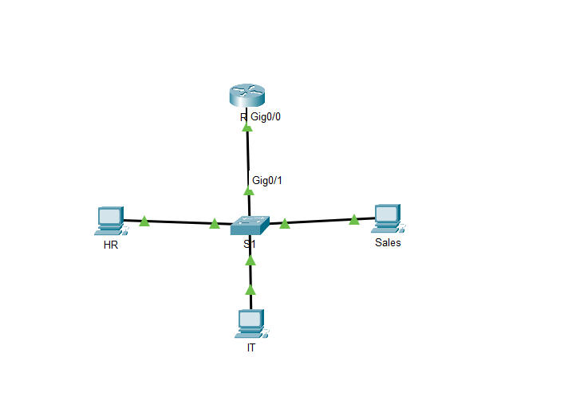
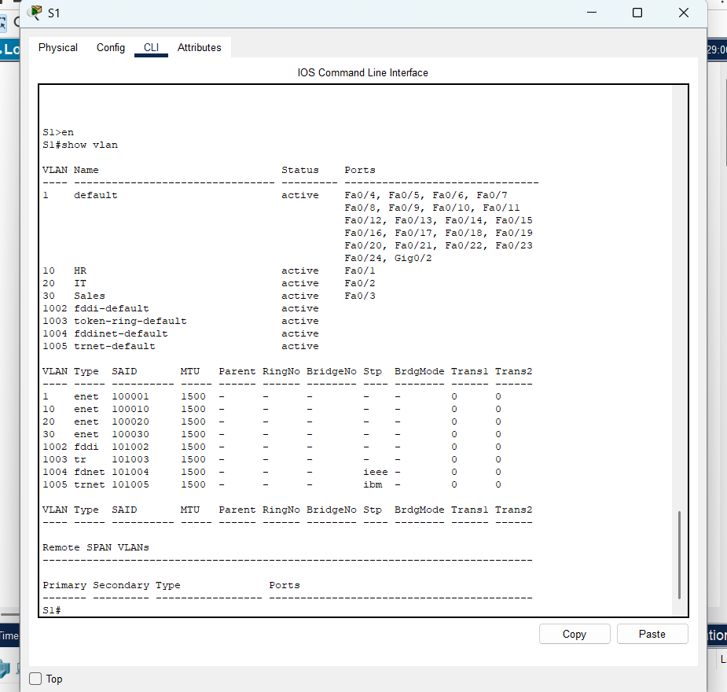
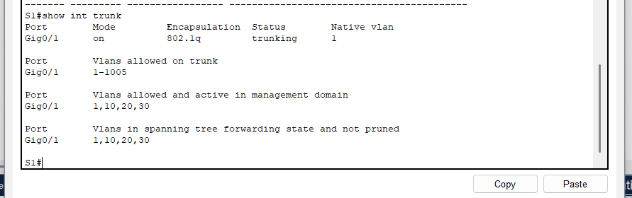
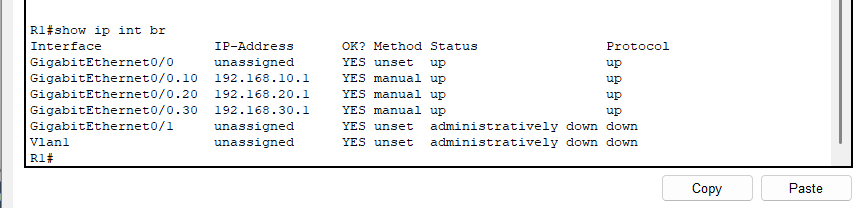
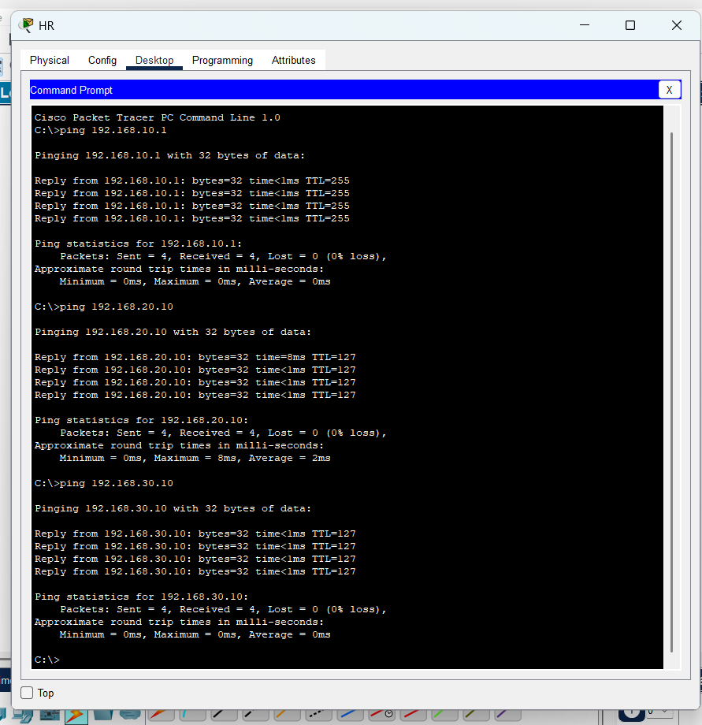

## VLAN & Inter-VLAN Routing (Router-on-a-Stick)

### Objective
Built a small enterprise network using VLANs and router-on-a-stick
to enable communication between multiple departments.

### Topology
- 1 Router
- 1 Switch
- 3 VLANs (HR, IT, Sales)

### Technologies Used
- Cisco Packet Tracer
- VLANs
- 802.1Q Trunking
- Inter-VLAN Routing
- IPv4 Addressing

### Key Configurations
- VLAN creation and access port assignment
- Trunk link between switch and router
- Router subinterfaces with dot1Q encapsulation
- End-to-end connectivity testing

### Verification
- Successful pings between all VLANs
- Interfaces and trunks verified using show commands

### Files
- inter-vlan-routing.pkt – Packet Tracer project file
- Screenshots folder – Configuration and verification evidence

## Screenshots

Below are configuration and verification screenshots demonstrating
successful VLAN configuration and inter-VLAN routing.

### Network Topology

This topology shows a router-on-a-stick design with one router connected
to a switch using an 802.1Q trunk, supporting three VLANs (HR, IT, Sales).

---

### VLAN Configuration on Switch

VLANs 10 (HR), 20 (IT), and 30 (Sales) are created and assigned to the
correct access ports on the switch.

---

### Trunk Port Verification

The switch port connected to the router is configured as an 802.1Q trunk,
allowing VLANs 1, 10, 20, and 30 to pass traffic.

---

### Router Subinterfaces (Inter-VLAN Routing)

Router subinterfaces are configured with dot1Q encapsulation for each VLAN,
providing default gateways for all networks.

---

### Inter-VLAN Connectivity Test

Successful ping tests confirm full connectivity between hosts in different
VLANs, verifying correct inter-VLAN routing.

